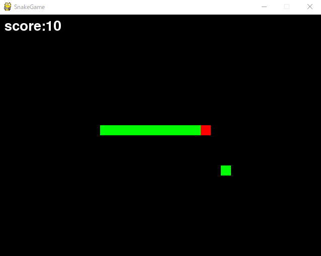

# SnakeGame

このゲームはpythonで実装しています。

## 遊び方

えさを食べて蛇を大きく成長させるゲームです。
蛇の頭を赤色、蛇の体とえさを緑色で表しています。
蛇の頭が壁に当たるか自身の体に衝突したらゲーム終了です。
隠しコマンドがあります。

## 操作方法

* ← / 左に移動
* → / 右に移動
* ↑ / 上に移動
* ↓ / 下に移動

## プレー画面

