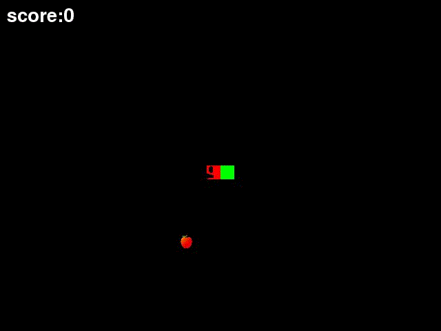

# SnakeGame

## 実行環境
Python 3.7

### 追加パッケージ
* pygame
* numpy
* natsort

## 遊び方
えさを食べて蛇を大きく成長させるゲームです。
蛇の長さが長くなるほど速くなります。
蛇の頭を赤色、蛇の体とえさを緑色で表しています。
蛇の頭が壁か自身の体に衝突したらゲーム終了です。
隠しコマンドがあります。

## 操作方法
* ← / 左に移動
* → / 右に移動
* ↑ / 上に移動
* ↓ / 下に移動
* Enter / 決定

## プレー画面
  
[gifの作成プログラム](gif_creater.py)